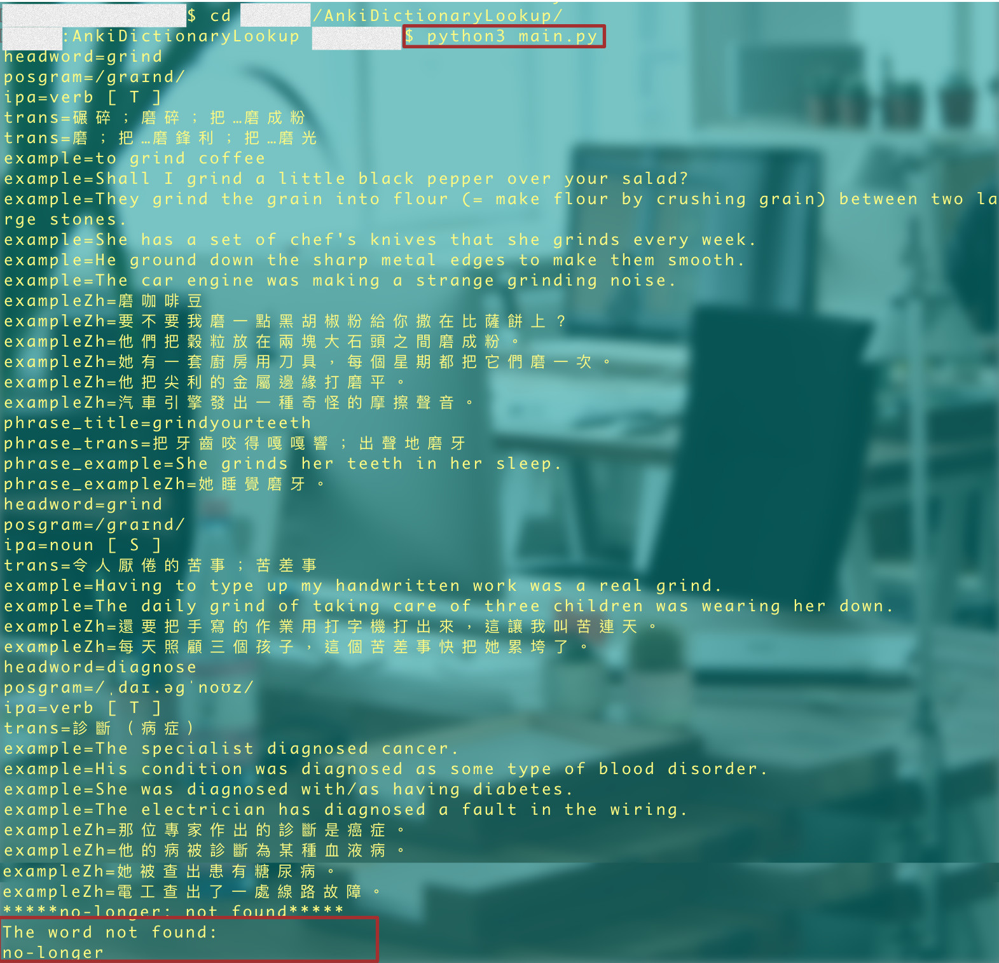
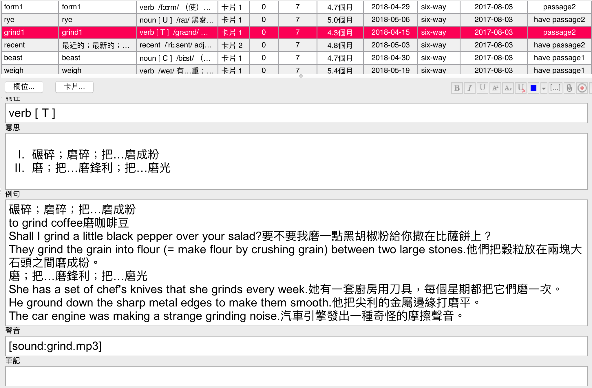
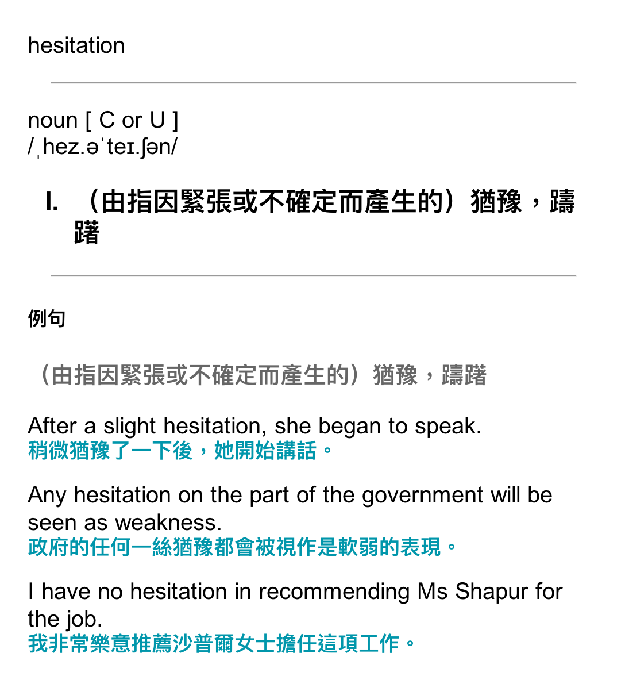
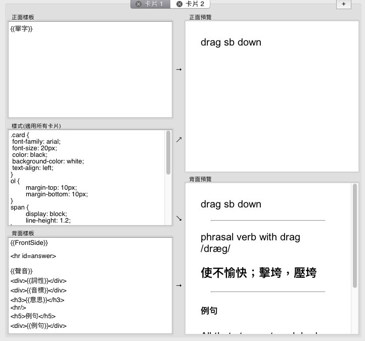

# Anki Dictionary Look up

look up words in Cambridge Dictionary via web Crawler.

## SetUp
1. Python3
2. BeautifulSoup

## Usage
1. typing words you want to look up in the file named `input`
2. run a Python script `python3 main.py`
3. the result would under the folder `result`, importing the anki.txt file to your deck and moving mp3 files to the `collection.media`.

----

透過python查詢Cambridge Dictionary

## 使用步驟
1. 在input file 中輸入要查找的單字
2. 執行指令`$ python3 main.py`
3. 結果會存放在result資料夾下方，你可以在anki中使用import file 用檔案`anki.txt`新增卡片。並將聲音檔案移至`collection.media`這個資料夾。

> - 需要注意deck 的欄位：我的欄位依序為：單字、音標、詞性、意思、例句、聲音。如果想自行異動就要去改寫`main.py`
> - `collection.media`位置在：/Users/{使用者名稱}/Library/Application Support/Anki2/{牌組名稱}
> - 同單字，不同詞性會存成不同卡片，但在單字欄位會被系統判讀為重複卡片，我自己會幫欄位加上上標數字區分
> - 單字含有多種意涵卡片會很長...
> - 指令執行完畢後會印出not found，再自行查找
> - idiom納入未來擴充

## 卡片顯示與樣式設定

### 樣式
	.card {
	 font-family: arial;
	 font-size: 20px;
	 color: black;
	 background-color: white;
	 text-align: left;
	}
	ol {
		margin-top: 10px;
		margin-bottom: 10px;
	}
	span {
		display: block;
		line-height: 1.2;
	}
	.examp {
		margin-bottom: 15px;
	}
	.examp > span:last-child {
		font-size: 18px;
		font-weight: bold;
		color: #0096ab;
	}
	.trans {
		color: #666;
		font-size: 20px;
		font-weight: 600;
		margin-top: 20px;
		margin-bottom: 20px;
	}

## 卡片

## 在例句中的html格式

	

		
<!-- 意思 -->

		<!-- 該意思中的例句第一個span為英文，第二個span為該例句中文 -->
		

			
			
		

	

	

		
<!-- 意思 -->

		<!-- 該意思中的例句第一個span為英文，第二個span為該例句中文 -->
		

			
			
		

	

	<!-- ...該單字有幾個意思就會有多個div with class 'def-block' -->

